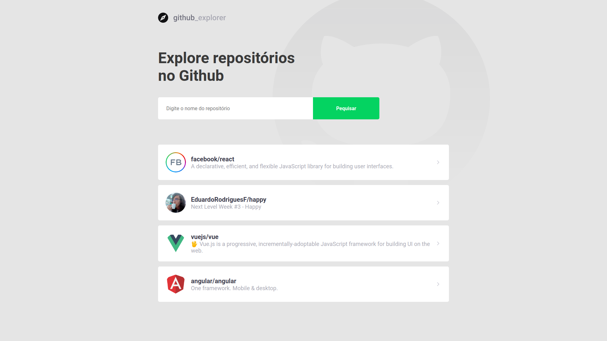
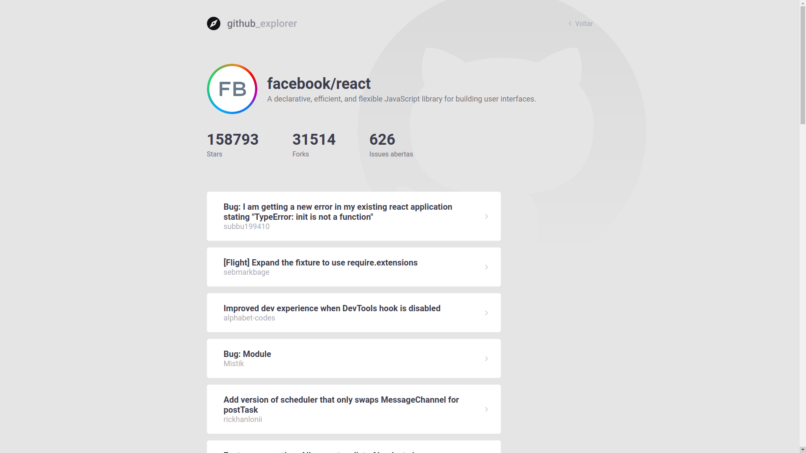

<p align="center">
  

  <p align="center">React application from <i>Gostack Bootcamp</i> using <a href="api.github.com">Github API</a>.</p>
</p>

<p align="center">
    <a href="#about">About</a> •
    <a href="#preview">Preview</a> •
    <a href="#learning">What I learned</a> •
    <a href="#techs">Technologies</a> •
    <a href="#usage">Usage</a> •
    <a href="#license">License</a>
</p>

<h2 id="about">🤔 About</h2>

Github Explorer is a web application that allows you to browse through repositories. It is the first ReactJS application guided on GoStack Bootcamp

<h2 id="preview">👁️ Preview</h2>

<p align="center">
  
  
  
</p>


<h2 id="learning">🧠 What I learned</h2>

- Create fully functional ReactJS apps
- Use styled components
- Adoption of code patterns with ESLint and Prettier
- Consume APIs inside React

<h2 id="techs">🛠️ Technologies</h2>

 - ReactJS
 - TypeScript
 - Styled Components
 - Code patterns
    - ESLint
    - Prettier
    - EditorConfig

<h2 id="usage">📋 Usage</h2>

Install the dependencies:
```bash
$ yarn
# or npm install
```
Run `start` script:
```bash
$ yarn start
# or npm start
```

<h2 id="license">📜 License</h2>

This project is under the <a href="">MIT license</a>
